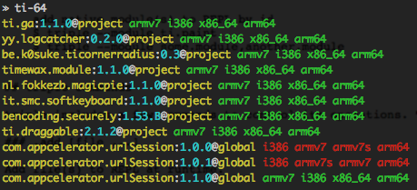

# Ti-64 [](https://david-dm.org/fokkezb/ti-html2as#info=dependencies)

Check all [Appcelerator Titanium](http://appcelerator.com/titanium) project and/or global modules for 64-bit iOS support.



## Install [](http://badge.fury.io/js/ti-64)

As global CLI:

    $ npm install -g ti-64

As module:

    $ npm install ti-64 --save

## Usage

### CLI

Check local and global modules required in a project's `tiapp.xml`:

    ~/project $ ti-64
    $ ti-64 --project-dir ~/project

Check all global modules:

    $ ti-64 --global
    
Check a specific `lib*.a` file:

	$ ti-64 build/libmy.module.a
	
Check all `lib*.a` files under a given path:

	$ ti-64 ./

Get the output as JSON:

    $ ti-64 --output json

    {
      "err": null,
      "res": {
        "analytics.google": {
          "name": "analytics.google",
          "has64": false,
          "versions": [
            {
              "name": "analytics.google",
              "version": "1.0",
              "path": "/path/to/analytics.google/1.0",
              "global": true,
              "architectures": [
                "armv7",
                "i386"
              ],
              "has64": false
            }
          ]
        }
      }
    }

### Module

```
var ti64 = require('ti-64');

ti64({
	projectDir: './project',
	// global: true,
	// path: './build/my.module.a'

}, function handle(err, res) {

  if (err) {
    console.error(err);

  } else {

    for (var module in res) {
      console[module.has64 ? 'log' : 'error'](module.name);

      for (var version in module.version) {
        console[version.has64 ? 'log' : 'error'](version.version + ' (' + (version.project ? 'project' : 'global') + ') ' + (version.error || version.architectures.join(' ')));
      }

    }

  }

});
```

### Changelog

* 2.1.0: Adds checking a given or all `lib*.a` files for a given path
* 2.0.0: Adds JSON output, Groups results by module, Improves error when ran outside of project, Adds update notification
* 1.1.0: Improved module API, Fixes #2, Fixes `-g` still requiring to be run in project
* 1.0.0: Initial version