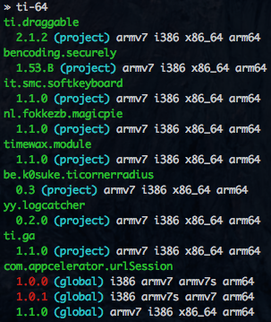

# Ti-64

[](https://david-dm.org/fokkezb/ti-html2as#info=dependencies)
[](https://david-dm.org/fokkezb/ti-html2as#info=devDependencies)

Check all [Appcelerator Titanium](http://appcelerator.com/titanium) project and/or global modules for 64-bit iOS support.



## Install [](http://badge.fury.io/js/ti-64)

As global CLI:

  $ npm install -g ti-64

As module:

  $ npm install ti-64 --save

## Usage

### CLI

Check local and global modules required in a project's `tiapp.xml`:

	~/project $ ti-i64
	$ ti-64 --project-dir ~/project

Check all global modules:

	$ ti-64 --global

### Module

```
var ti64 = require('ti-64');

ti64({
	projectDir: './project',
	global: false
});
```